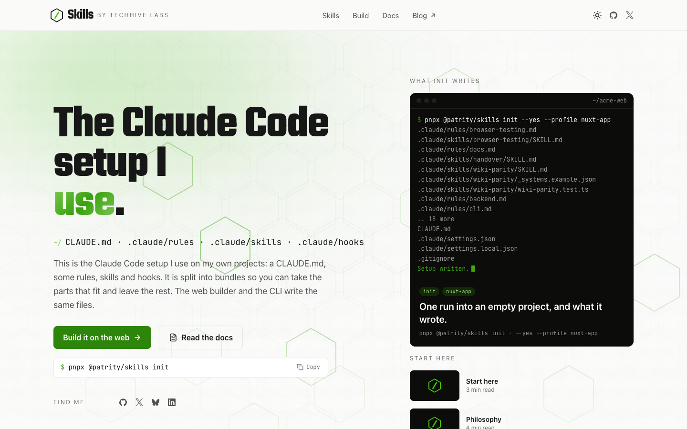

# Skills

This is the Claude Code setup I use on my own projects, published so it can be installed instead
of copied. Answer a short list of questions and you get a `CLAUDE.md` and a `.claude/` directory
shaped like mine: rules that carry the direction, skills that carry the how-to, hooks that fail
closed, and docs a test keeps honest. It is split into bundles under [`skills/`](skills/), so you
can take the parts that fit and leave the rest.

The site reads those bundles straight from this repository at request time, so publishing a bundle
never rebuilds the app.



## Two ways in

[skills.patrity.com/build](https://skills.patrity.com/build) runs the wizard in the browser. Pick a
preset, answer the questions, watch the `CLAUDE.md` compose beside the form, then download a zip and
unzip it into a new project folder.

In a terminal it is one command:

```bash
pnpx @patrity/skills
```

[`@patrity/skills`](https://www.npmjs.com/package/@patrity/skills) runs the same wizard, and after
that `add`, `remove`, `update` and `diff` keep the project current as bundles change. Both front
ends call the same planner in `shared/setup/`, so they write the same files.

See `cli/README.md` or [skills.patrity.com/docs/cli](https://skills.patrity.com/docs/cli) for every
command, and [/docs/start-here](https://skills.patrity.com/docs/start-here) for the walkthrough.

## Use a single bundle

None of it is all-or-nothing. Every bundle has its own page with a download button and a readable
file tree, so you can take the browser-testing workflow or the fail-closed hooks and leave the
rest. Copy the contents into your project's `.claude/`, paste the bundle's `CLAUDE.md` snippet
into your own, and add whatever the page lists under **Gitignore** and **Environment**. Details:
[/docs/single-bundle](https://skills.patrity.com/docs/single-bundle).

## Philosophy

- **Rules and skills stay apart.** A rule is a `paths:`-scoped file that loads on its own and
  states what must be true. A skill is the procedure, invoked when it is needed. Keeping them
  apart is what keeps `CLAUDE.md` short enough to be read.
- **Hooks fail closed.** I moved the checks I keep forgetting into hooks, so the harness runs them
  rather than me. When a hook script goes missing, the wiring asks git whether it was supposed to
  exist and exits 2 if it was.
- **Docs come in three tiers.** Handovers for what shipped, a living wiki for how things work
  today, frozen specs for what was intended. The wiki tier gets a parity test, because it is the
  one that rots on me.
- **UI work is checked in a real browser with `playwright-cli`.** The rule keeps me off the
  Playwright MCP while the CLI is available, so there is one browser session and one source of
  truth for refs. A green typecheck has never caught a component that failed to mount.
- **Memory and process are questions.** The MyMind memory server and the brainstorm, spec, plan,
  TDD and review cycle are each an answer you give in the wizard. Memory is off unless you turn
  it on.

The longer version, with the bundle behind each one:
[/docs/philosophy](https://skills.patrity.com/docs/philosophy).

## Superpowers

The `full` and `lightweight` workflow answers lean on [Superpowers](https://github.com/obra/superpowers),
obra's plugin: the `CLAUDE.md` this setup writes points Claude at its `brainstorming`,
`writing-plans`, `subagent-driven-development`, `test-driven-development` and
`requesting-code-review` skills. Install it into your user plugins, where it covers every project
on the machine:

```text
/plugin install superpowers@claude-plugins-official
```

That is the official marketplace. obra's own works too:

```text
/plugin marketplace add obra/superpowers-marketplace
/plugin install superpowers@superpowers-marketplace
```

The [plugin page](https://claude.com/plugins/superpowers) lists what is in it. Answer `none` to the
workflow question and you can skip it.

## MyMind

Answering `on` to the memory question wires [MyMind](https://github.com/Patrity/mymind), my own
open-source memory server, into the generated `CLAUDE.md`: search it before answering from
recollection, mirror docs into it, keep tasks there. It is useful to me across sessions and useless
to you unless you run it, so the question is off by default.

## Configuration and caches

Skills read configuration from `.claude/.env`, never the repo root `.env`, so a project can point
Claude at a read-only database replica while the app keeps its own connection string. A bundle
declares what it reads with the `env` frontmatter key and never ships a `.env.example` of its own;
the tool assembles `.claude/.env.example` for the whole project and regenerates it on every run, so
your values go in `.claude/.env` and stay there.

Anything a skill caches lives under that skill's own directory and is declared with the `gitignore`
frontmatter key. Those paths, plus `.claude/.env` and `.claude/settings.local.json`, land in one
managed block in the project's root `.gitignore`:

```text
# >>> skills (managed by @patrity/skills; edit outside this block)
.claude/.env
.claude/settings.local.json
.claude/skills/nuxt-docs/cache/
# <<< skills
```

Every run regenerates the block. Lines outside it are never touched.

## Contributing

This is a personal registry first, and pull requests are welcome anyway. A bundle that is
genuinely reusable, carries no secrets and keeps to one concern has a good chance of being merged.
See `content/docs/contributing.md`.

## Bundle structure

Create `skills/<slug>/README.md` with frontmatter (`name`, `description`, `tags`, `author`, optional
`authorUrl`/`requires`/`dependsOn`/`suggests`/`gitignore`/`env`) and add the `.claude` content beside
it. Run `pnpm validate:skills`, open a PR.

## Development

```bash
pnpm install
pnpm dev            # http://localhost:3000, reads ./skills from disk
pnpm test:unit      # fast unit tests
pnpm test           # + route tests (builds the app once)
pnpm typecheck && pnpm lint && pnpm build
```

`SKILLS_SOURCE=github pnpm dev` exercises the production path (GitHub zip archive → parsed snapshot). `SKILLS_SOURCE` is read at build/dev time by `nuxt.config.ts`; the **built** server reads `NUXT_SKILLS_SOURCE` instead (same values), so set that one on a deployed instance. Copy `.env.example` to `.env` for the knobs.

## How it works

- `server/lib/skills/` parses bundles from disk (`fs`) or from the repo zip archive (`github`), caches per-bundle blobs in the Vercel Runtime Cache under tag `skills`, and serves them through `/api/skills/**`.
- `shared/setup/` composes a project from the base questions and the picked bundles. The CLI, the `/build` page and `POST /api/build` all go through it.
- Pages and API routes are ISR-cached (5 min floor) and tagged; `POST /api/revalidate` purges the tag. After a purge a warm instance re-reads the Runtime Cache within ~5s (its in-process memo TTL); the 5-minute ISR floor is only the backstop.
- A failing upstream never becomes a cached 404 or empty page: a warm instance (one that already holds a snapshot) keeps serving it stale, while a cold instance (nothing loaded yet) answers 503 until the source recovers. Either way Vercel serves the response as stale rather than caching it.
- On a push that touches `skills/**`, Vercel skips the build (`vercel.json` `ignoreCommand`) and the `revalidate` workflow purges the cache instead.

## Deploy

Vercel, Git integration on `main`. Environment variables: `NUXT_REVALIDATE_SECRET`, `NUXT_PUBLIC_SITE_URL`, `NUXT_GITHUB_TOKEN`, `NUXT_OG_IMAGE_SECRET`; production-only `NUXT_PUBLIC_UMAMI_ID` and `UMAMI_DOMAINS` (build-time). GitHub Actions needs the `SITE_URL` variable and `REVALIDATE_SECRET` secret.

`NUXT_OG_IMAGE_SECRET` signs every `/_og/**` URL and has to stay the same across deploys: rotate it and the og:image links social networks already cached stop validating.

`NUXT_GITHUB_TOKEN` is strongly recommended in production: serverless functions share egress IPs, so the unauthenticated GitHub limit (60 requests/hour/IP) is easily exhausted by neighbours. A fine-grained read-only token raises it to 5,000/hour.

## License

MIT. See [LICENSE](LICENSE).
